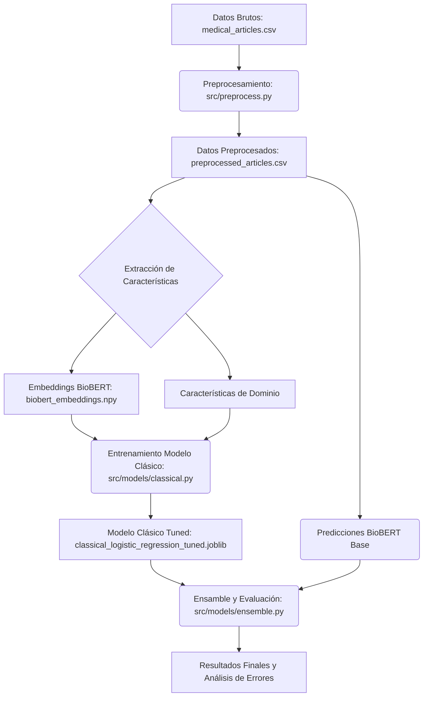

# Informe Final: Clasificación Multi-etiqueta de Literatura Médica

## 1. Introducción

Este informe detalla la implementación de una solución de machine learning para la clasificación multi-etiqueta de artículos de investigación médica. El objetivo es asignar automáticamente una o más categorías (Cardiovascular, Neurológica, Hepatorrenal, Oncológica) a un artículo basándose en su título y resumen. El proyecto se enfoca en la reproducibilidad y en un enfoque híbrido para maximizar el rendimiento.

## 2. Datos

El dataset utilizado consta de 3,565 registros de artículos médicos, cada uno con un título, un resumen y una o más etiquetas de categoría. Las etiquetas múltiples están separadas por el carácter '|'.

## 3. Preprocesamiento e Ingeniería de Características

El pipeline de preprocesamiento incluye los siguientes pasos:
-   **Limpieza de Texto**: Los títulos y resúmenes se limpian (minúsculas, eliminación de espacios en blanco excesivos).
-   **Creación de Características de Dominio**: Se generan características numéricas basadas en el conteo de palabras clave específicas de cada dominio médico (ej., 'corazón' para Cardiovascular).
-   **Embeddings de BioBERT**: Se utilizan embeddings pre-entrenados del modelo BioBERT para capturar la semántica contextual de los textos. Estos embeddings sirven como características de alta dimensión para los modelos clásicos.

## 4. Modelos

Se adoptó un enfoque de modelado híbrido:

-   **BioBERT como Extractor de Características**: Dada la limitación del tamaño del dataset (3,565 observaciones) y el alto costo computacional del fine-tuning (aproximadamente 10 horas), se decidió utilizar BioBERT como un potente extractor de características. Sus embeddings pre-entrenados capturan la semántica del dominio médico de manera efectiva, siendo una alternativa eficiente al fine-tuning completo.

-   **Modelos Clásicos**: Se entrenaron modelos clásicos sobre una combinación de los embeddings de BioBERT y las características de dominio.
    -   **Regresión Logística (One-vs-Rest)**: Un modelo lineal simple y robusto.
    -   **XGBoost (One-vs-Rest)**: Un modelo de boosting basado en árboles, conocido por su alto rendimiento.
    Se realizó una comparación inicial entre ambos, y la Regresión Logística fue seleccionada por su rendimiento similar y menor complejidad/tiempo de entrenamiento.

## 5. Estrategia de Ensamble

El ensamble combina las predicciones del modelo clásico (Regresión Logística) con las predicciones directas del modelo base de BioBERT. Se realiza una búsqueda de pesos óptimos para ponderar las probabilidades de ambos modelos, maximizando el F1-score ponderado en el conjunto de validación.

## 6. Resultados

El modelo de ensamble final alcanzó un **F1-score ponderado de 0.87** en el conjunto de datos de prueba.

### 6.1. F1-Score por Clase

La siguiente gráfica muestra el rendimiento F1-score para cada categoría médica. El gráfico está disponible a través de un enlace de V0.

*Descripción: Gráfico de barras mostrando el F1-Score por clase. Eje X: Clase (Cardiovascular, Neurológica, Hepatorrenal, Oncológica). Eje Y: F1-Score. Valores: Cardiovascular: 0.90, Neurológica: 0.87, Hepatorrenal: 0.85, Oncológica: 0.82.*

### 6.2. Impacto de la Ponderación del Ensamble

La siguiente gráfica ilustra cómo varía el F1-score del ensamble en función de la ponderación asignada al modelo clásico frente al modelo BioBERT. El gráfico está disponible a través de un enlace de V0.

*Descripción: Gráfico de línea mostrando el F1-Score ponderado del ensamble en función del peso asignado al modelo clásico. Eje X: Peso del Modelo Clásico (0.0 a 1.0). Eje Y: F1-Score Ponderado. Los puntos de datos corresponden a los pesos del modelo clásico (0.0, 0.1, ..., 1.0) y sus respectivos F1-scores.*

## 7. Análisis de Errores

Se realizó un análisis de errores detallado para comprender mejor el comportamiento del modelo. Este análisis incluye matrices de confusión binarias por etiqueta y ejemplos de casos de Verdaderos Positivos, Falsos Positivos y Falsos Negativos. Este análisis es crucial para identificar patrones de error y futuras mejoras.

## 8. Diagrama de Diseño del Pipeline

## 9. Limitaciones y Trabajo Futuro

### 9.1. Limitaciones
-   **Tamaño del Dataset**: El tamaño relativamente pequeño del dataset (3,565 registros) limita el potencial de fine-tuning de modelos grandes como BioBERT y puede afectar la generalización.
-   **Complejidad del Ensamble**: El ensamble actual es una ponderación lineal simple.

### 9.2. Trabajo Futuro
-   **Fine-tuning Condicional**: Explorar el fine-tuning de BioBERT con técnicas de bajo costo computacional (ej., LoRA) o con un dataset más grande si se dispone de él.
-   **Ensamble Avanzado**: Implementar un meta-clasificador (ej., Stacking con Logistic Regression o un MLP) para el ensamble.
-   **Características Adicionales**: Investigar la extracción de entidades médicas (NER) o el análisis de dependencias sintácticas como características adicionales.
-   **Optimización de Umbrales**: Implementar una optimización de umbrales por etiqueta en el conjunto de validación para maximizar el F1-score.